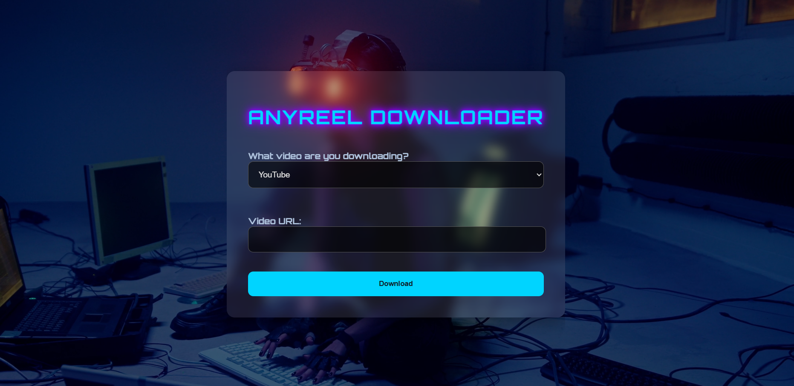

# Anyreel Downloader



## Overview

**Anyreel Downloader** is a simple yet powerful web application that allows users to download videos from multiple platforms, including YouTube and Instagram Reels. Built using Django, this application provides a user-friendly interface where users can input the video URL and select the platform to download their desired videos directly to their local machine.

## Features

- **Multi-platform Support**: Download videos from YouTube, Instagram Reels, and other video hosting platforms.
- **Automatic File Naming**: The downloaded videos are automatically named based on the video title, ensuring that users can easily organize their downloads.
- **Simple UI**: A clean and straightforward user interface, making it accessible for users with varying technical expertise.
- **Robust Error Handling**: The application handles errors gracefully, providing clear messages when something goes wrong.
- **Video Duration Checks**: The app ensures that only videos within a specified duration range are downloaded, preventing extremely short or long downloads.
- **Real-time Download Status**: Displays a looping circle animation indicating the download process, ensuring users know the app is working.

## Getting Started

### Prerequisites

- Python 3.8+
- pip (Python package installer)
- Git
- Django
- yt-dlp
- instaloader
- requests

### Installation

1. **Clone the repository**:

   ```bash
   git clone https://github.com/your-username/Anyreel.git
   cd Anyreel
   ```

2. **Create and activate a virtual environment**:

   ```bash
   python -m venv venv
   venv\Scripts\activate  # On Windows
   source venv/bin/activate  # On macOS/Linux
   ```

3. **Install the required dependencies**:

   ```bash
   pip install -r requirements.txt
   ```

4. **Apply migrations**:

   ```bash
   python manage.py migrate
   ```

5. **Run the development server**:

   ```bash
   python manage.py runserver
   ```

   Visit `http://127.0.0.1:8000/` in your browser to see the application in action.

### Usage

1. Enter the URL of the video you wish to download.
2. Select the platform (YouTube, Instagram Reels, or other).
3. Click the "Download" button.
4. The download progress will be indicated by a looping circle. Once the download is complete, the video will be saved to your `Downloads` folder.

### Project Structure

- `downloader/`: Contains the core Django app files, including views, models, forms, and templates.
- `static/`: Stores static files such as CSS, JavaScript, and images.
- `templates/`: Holds HTML templates for rendering web pages.
- `venv/`: The virtual environment for managing dependencies.
- `requirements.txt`: Lists all the dependencies required to run the project.
- `image.png`: A screenshot showing the user interface of the application.

## Deployment

This project is ready for deployment on Heroku. Follow these steps to deploy the app:

1. Push the code to your GitHub repository.
2. Create a new app on Heroku.
3. Connect your GitHub repository to the Heroku app.
4. Enable automatic deploys from the `main` branch.
5. Run `python manage.py migrate` and `python manage.py collectstatic --noinput` on Heroku.

For more detailed steps, refer to the [Heroku Deployment Guide](https://devcenter.heroku.com/articles/getting-started-with-django).

## License

This project is licensed under the MIT License - see the [LICENSE](LICENSE) file for details.

## Acknowledgments

- [Django](https://www.djangoproject.com/) - The web framework used for building the app.
- [yt-dlp](https://github.com/yt-dlp/yt-dlp) - A powerful video downloader used to fetch videos from various platforms.
- [Instaloader](https://instaloader.github.io/) - A tool to download Instagram Reels.

---

**Developed by [Your Name](https://github.com/your-username)** - Feel free to fork, contribute, or reach out for collaboration.
```

This version should maintain the correct formatting for your README. Replace placeholders like `your-username` with your actual GitHub username before uploading.